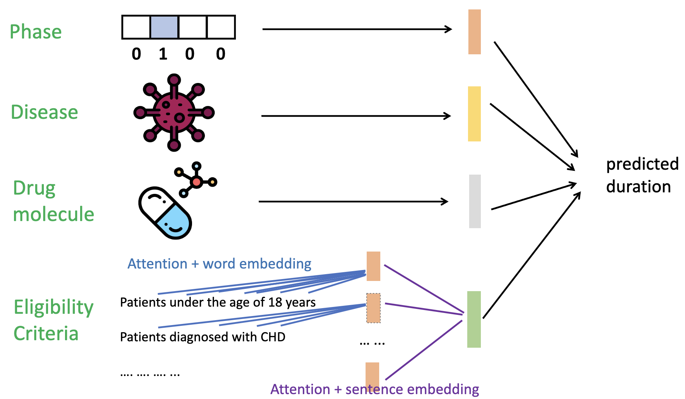

# TrialDura: Hierarchical Attention Transformer for Interpretable Clinical Trial Duration Prediction

[](https://arxiv.org/abs/2404.13235)

Congratulations! This paper has been accepted at the 2024 NeurIPS workshop!

## Overview

TrialDura is a hierarchical attention transformer model designed for interpretable clinical trial duration prediction. This repository contains the code and instructions to reproduce the results presented in our paper.




## Installation

To set up the environment, follow these steps:

```bash
conda create -n clinical python==3.8
conda activate clinical
pip install rdkit
pip install tqdm scikit-learn seaborn numpy pandas icd10-cm
conda install pytorch==1.13.1 torchvision==0.14.1 torchaudio==0.13.1 pytorch-cuda=11.7 -c pytorch -c nvidia
conda install conda-forge::transformers
pip install tensorboard
conda install lightgbm
conda install xgboost
```

### System Requirements

- **Operating System:** Debian 6.1.0-18-amd64
- **Kernel Version:** 6.1.76-1 (2024-02-01)
- **Architecture:** x86_64
- **Conda Version:** 24.3.0
- **Python Version:** 3.8.19
- **PyTorch Version:** 1.12.1
- **Torchvision Version:** 0.13.1
- **Torchaudio Version:** 0.12.1

## Preprocessing

### ClinicalTrial.gov Data

```bash
cd data/raw
wget https://clinicaltrials.gov/AllPublicXML.zip
unzip AllPublicXML.zip -d ../trials
cd ..

find trials/* -name "NCT*.xml" | sort > trials/all_xml.txt
```

### Generate Target Time

Run the notebook `preprocess/generate_target.ipynb`.

### DrugBank Data

1. Apply for a DrugBank license at [DrugBank](https://go.drugbank.com/releases/latest).
2. Download the full database XML file and place it in the `data/raw` directory.
3. Run the notebook `preprocess/drugbank_xml2csv.ipynb`.

### Disease Data

```bash
python preprocess/collect_disease_from_raw.py
```

### Selection Criteria of Clinical Trials

```bash
python preprocess/collect_raw_data.py | tee data_process.log
python preprocess/collect_input_data.py
```

### Data Split

```bash
python preprocess/data_split.py
```

### Sentence to Embedding

Note that this process is computationally intensive and may take some time. It is recommended to run it in the background.

```bash
python preprocess/protocol_encode.py
```

## Model Training

Run the notebook `model/run_NN.ipynb`.

## Visualization

You can visualize the results using TensorBoard. The logs are located under the `logs/` directory.

## Citation

If you find this repository useful in your research, please cite our paper:

```bibtex
@article{yue2024trialdura,
  title={TrialDura: Hierarchical Attention Transformer for Interpretable Clinical Trial Duration Prediction},
  author={Yue, Ling and Li, Jonathan and Islam, Md Zabirul and Xia, Bolun and Fu, Tianfan and Chen, Jintai},
  journal={arXiv preprint arXiv:2404.13235},
  year={2024}
}
```
